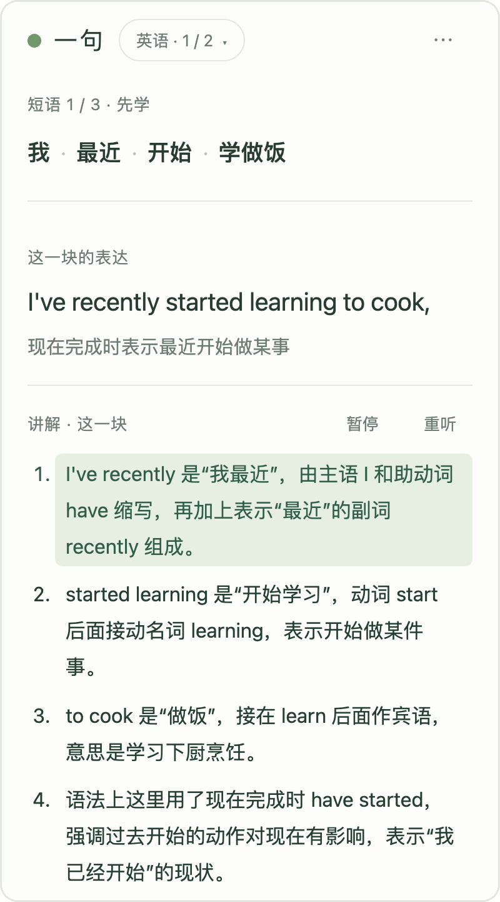

# 一句 · 把想说的中文练成英语或日语

一句帮你把自己想说的话练成英语或日语。粘贴一段聊天、写作或想法，它先整理出中文的核心意思和结构，再准备对应的外语表达，拆成几小块：每一块先听讲解、看懂，再遮住凭记忆写出来；最后自己重新写整句，拿到分数、点评和改好的写法。写错的地方会再做一次填空小测，也可以推送到 Anki 以后复习。卡住时按 ⌘ ] 叫语音陪练，用中文讲词义、搭配和语法。



练的永远是**你自己想说的话**，不是课本上的句子：词汇和语法服务于眼下这次表达，看提示不扣分，完成一次表达也不等于已经掌握。

## 两种用法

- **浏览器插件版（推荐）**：装一个 Edge / Chrome 插件，一句就开在浏览器侧边栏里。不用装 Node，不用命令行；所有模型由插件直接调用，不经过任何服务器。在任何网页上选中一段文字，右键「用一句练这段话」就能开始。
- **本机服务版**：在电脑上跑一个 Node 服务，一句开在单独的标签页里。适合想改代码的人；还带着旧版主题练习（`/legacy`）、macOS 桌面启动器和给 Codex 用的命令行接口。

## 插件版

1. 拿到插件：从 [Releases](https://github.com/John15263/yiju/releases) 下载最新的 `yiju-extension-<版本>.zip` 并解压；或者自己构建（需要 Node 24）：`node edge/build.mjs`，生成 `dist/edge/` 文件夹。
2. Edge 打开 `edge://extensions`（Chrome 是 `chrome://extensions`），打开「开发人员模式」，点「加载解压缩的扩展」，选解压出来的文件夹（自己构建的话是 `dist/edge`；**不是**源代码里的 `edge` 文件夹）。
3. 点工具栏上一句的图标（一个绿色圆点），侧边栏打开，会弹出「服务与 key」：文字、语音陪练、朗读分别选一家，填 key，点「保存并测试」。
   - **在中国大陆**：一个阿里云百炼的 key 就够了。文字选「阿里云百炼（千问）」，语音选「阿里云百炼」，区域选中国大陆，并填上**业务空间 ID**（插件里的语音走 WebRTC，必须用业务空间的专属地址；在百炼控制台右上角能看到）；朗读选「浏览器自带」。文字也可以用 DeepSeek。
   - **在海外**：一个 [Gemini](https://aistudio.google.com/apikey) key 就能跑全套，朗读也可以用 Gemini（更自然）。
4. 点「放一段示例」，或者粘贴你自己的内容，选英语或日语，点「整理我的想法」。
5. 第一次按 ⌘ ] 开语音时，如果侧边栏没法直接要麦克风权限，一句会打开一个授权页，在那里允许一次就好。
6. Anki（可选）：Anki 要开着并装好 AnkiConnect 插件（代码 2055492159）。在「服务与 key」里勾上推送，点「保存并测试」：浏览器会问你是否允许连接本机，Anki 也会弹出窗口问是否允许一句推送卡片，都点允许就好。AnkiConnect 改过端口的话，在「AnkiConnect 地址」里填同一个端口。

插件的学习记录和 key 都存在浏览器的插件存储里，只发给你选的服务商。快捷键在 Windows 上把 ⌘ 换成 Ctrl。

## 本机服务版

需要 Node.js 24 或更新版本，不需要 `npm install`，没有第三方依赖。

```sh
git clone https://github.com/John15263/yiju.git
cd yiju
npm start               # 打开 http://127.0.0.1:4317
```

第一次打开会弹出「服务与 key」，和插件版一样。key 只存在本机的 `studio/data/settings.json`，页面上只显示末尾四位；这里的设置优先于 `.env`。也可以照 [.env.example](.env.example) 写 `.env`。端口可通过 `STUDIO_PORT` 修改。

**桌面启动（macOS）**：`studio/launcher.applescript` 用 `osacompile` 做成桌面 App 后，双击即可启动本地服务并在默认浏览器打开网页；服务已运行时直接复用。启动器里写着项目目录和 Node 的路径，移动项目或换 Node 版本后要改路径重新生成。运行日志在 `studio/data/launcher.log`。

## 服务商和花费

| 部分 | 可选 |
|---|---|
| 文字（整理材料、检查、提示、点评、讲解稿） | Gemini、DeepSeek、阿里云百炼（千问） |
| 语音陪练 | Gemini Live、阿里云百炼 Qwen-Omni-Realtime，或者不用语音 |
| 朗读（提示和讲解稿） | Gemini 朗读，或者浏览器自带的声音（不花钱） |

三家文字服务都用真实 key 把整轮练习跑通过。实测里 DeepSeek 整理材料较慢（约 30 秒），切出的表达块也偏碎；千问和 Gemini 的分块更自然。

每次调用的用量和按官方价格算出的花费记在本地，在「⋯ → 练习记录与设置 → 模型花费」查看今天、近 7 天和按用途的明细。一次 30 分钟的练习用 Gemini 实测约 $0.22，其中八成是语音陪练。DeepSeek 和千问的价格这里没有可靠来源，只记用量、不估金额，实际费用看服务商控制台。

## 隐私

没有开发者服务器，没有统计和广告。你的内容、学习记录和 key 只存在你自己的电脑上，只发给你选的服务商。详见 [PRIVACY.md](PRIVACY.md)。

## 更多说明

- [怎么用 · 完整说明](studio/docs/usage.md)：自由写作、整理材料、逐块先学再默写、提示、整句点评、语音陪练
- [短语练习](studio/docs/phrases.md)、[一句话接口](studio/docs/sentence.md)、[动态写作帮助](studio/docs/writing-help.md)、[自由写作](studio/docs/freewrite.md)
- [Gemini 配置 · 用量与花费](studio/docs/gemini.md)、[语音规则](studio/policies/voice-policy.md)、[API 与数据](studio/docs/api.md)
- 用 AI Agent（Claude Code、Codex 等）安装的话，让它读 [AGENTS.md](AGENTS.md)。

## 文件

- `edge/`：浏览器插件版的专用部分：侧边栏里跑引擎的 `backend.js`、浏览器存储 `store.js`、朗读缓存 `speech-cache.js`、百炼语音的 WebRTC 连接 `rtc.js`、右键菜单 `background.js`，以及 `build.mjs`（把 `studio/server/` 里能在浏览器跑的模块、`studio/web/` 页面和提示词组装成插件）。
- `studio/server/`：引擎和本机服务（只监听 127.0.0.1）。`sentence.mjs` 是练习状态；`preparation.mjs`、`phrases.mjs`、`review.mjs`、`writing-help.mjs`、`quiz.mjs`、`explain.mjs` 是各环节；`llm.mjs` 按设置选文字服务；`voice.mjs` 是语音中继（key 只在引擎这边），`voice-providers.mjs` 把 Gemini Live 和 Qwen-Omni 的协议翻译成同一组事件；`tts.mjs` 是朗读；`anki.mjs` 推送卡片。
- `studio/web/`：页面。`backend.js` 是页面和引擎之间唯一的接口（插件版换成 `edge/backend.js`）。
- `studio/prompts/`：提示词。
- `studio/packs/`、`studio/cli.mjs`、`.agents/skills/ball-setter/`：旧版主题练习和给 Codex 用的接口（仅本机版）。
- `studio/data/`：本地数据库、设置和 token，不提交。

```sh
npm test
```

## 许可证

[GNU AGPL-3.0](LICENSE)（或更新版本）。可以自由使用、修改和分发；如果你修改后通过网络向别人提供服务，也要以同样的许可证公开你的源代码。
