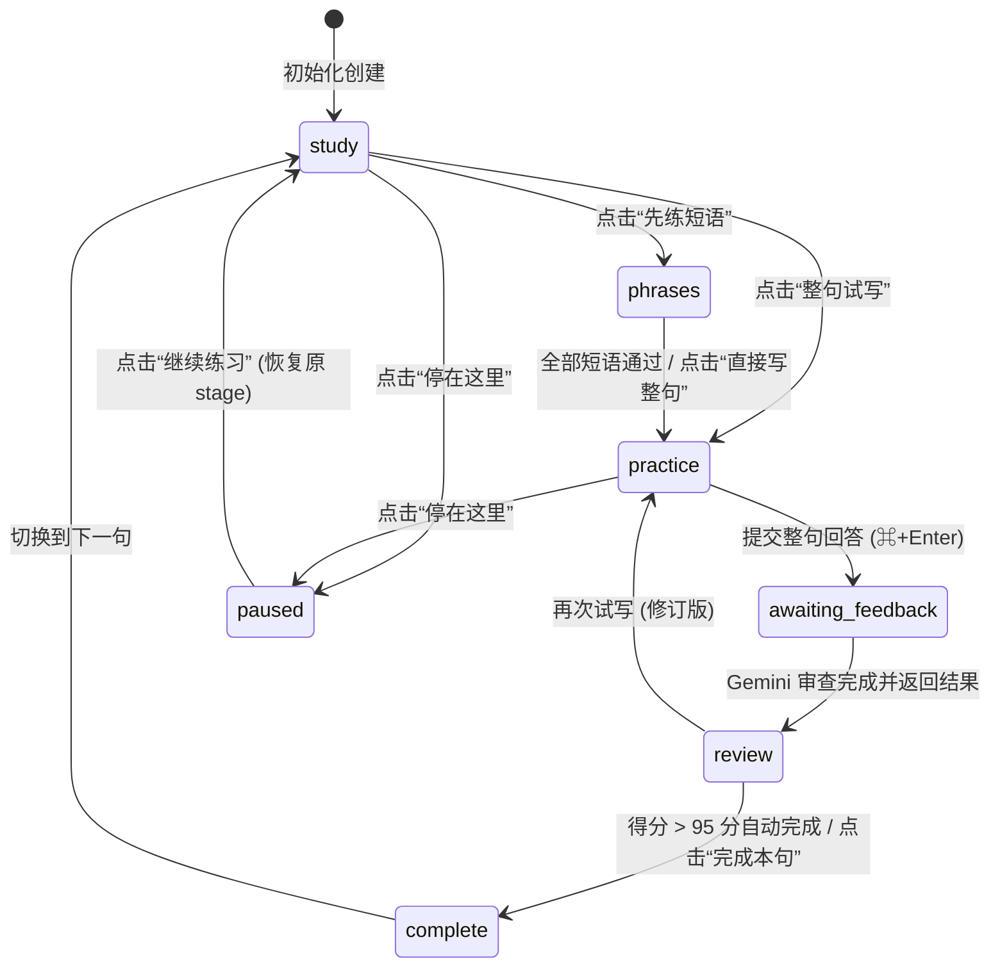

# “一句 · 摆球器” 前端交互与重构规格说明书 (Frontend Interaction & Redesign Spec)

> **目标读者**：负责对本项目前端进行**极简风格（Minimalist / Zen）重新设计与代码重构**的 AI 或前端开发工程师。  
> 本文档详述了当前系统的产品定位、交互状态机、全量业务逻辑、键盘快捷键、API 通信契约及本地持久化机制，确保在重构 UI/UX 时不破坏原有的核心教学闭环与稳健的交互机制。

---

## 目录
1. [产品定位与核心闭环](#1-产品定位与核心闭环)
2. [前端工程与模块结构](#2-前端工程与模块结构)
3. [核心交互状态机与全流程](#3-核心交互状态机与全流程)
4. [各功能模块详细交互逻辑](#4-各功能模块详细交互逻辑)
   - [4.1 全局顶栏与连接监控](#41-全局顶栏与连接监控)
   - [4.2 模块一：5分钟自由写作 (Freewrite)](#42-模块一5分钟自由写作-freewrite)
   - [4.3 模块二：构思与结构化提炼 (Compose)](#43-模块二构思与结构化提炼-compose)
   - [4.4 模块三：当前句主看板 (Board)](#44-模块三当前句主看板-board)
     - [A. 篇章与整段导航 (Collection)](#a-篇章与整段导航-collection)
     - [B. 理解与示范 (Study)](#b-理解与示范-study)
     - [C. 短语逐块试写 (Phrases Practice - 推荐主流程)](#c-短语逐块试写-phrases-practice---推荐主流程)
     - [D. 整句独立试写与智能伴写 (Sentence Practice & Writing Help)](#d-整句独立试写与智能伴写-sentence-practice--writing-help)
     - [E. 审查、打分与反馈 (Review & Feedback)](#e-审查打分与反馈-review--feedback)
     - [F. 逐空填空 (Cloze - 备选模式)](#f-逐空填空-cloze---备选模式)
   - [4.5 模块四：历史记录、暂停与恢复 (Records)](#45-模块四历史记录暂停与恢复-records)
5. [键盘快捷键映射全集](#5-键盘快捷键映射全集)
6. [数据模型与接口协议 (API Contracts)](#6-数据模型与接口协议-api-contracts)
7. [本地缓存与数据恢复策略 (LocalStorage / SessionStorage)](#7-本地缓存与数据恢复策略-localstorage--sessionstorage)
8. [接手 AI：极简重新设计与重构指南 (Redesign Directives)](#8-接手-ai极简重新设计与重构指南-redesign-directives)

---

## 1. 产品定位与核心闭环

“一句”是一个**重在“表达自己真实想法”的沉浸式双语学习工具（中英 / 中日）**。它的核心交互理念是**摆球器机制**：
- **从用户自己的真实表达出发**：不背诵他人现成文本，而是把用户自己的聊天记录、想法或自由书写的文字，转化为地道的外语表达。
- **渐进式认知台阶**：用户直接写长难句容易卡壳，系统通过“大纲理解 → 短语切块过关 → 隐藏参考整句试写 → AI 细致打分与反馈 → 自动流转下一句”逐步建立掌控感。
- **练习而非考试**：界面记录每一次回答时使用的辅助层级，完成一轮不等于长期掌握，强调低心智负担的反复尝试。

### 核心用户流转闭环

```
[可选：5分钟自由写作倾倒想法]
       │
       ▼
[粘贴/输入想法 + 选语言] ──(Gemini提炼)──▶ [大纲与逐句拆解预览] ──(确认)──┐
                                                                       │
┌──────────────────────────────────────────────────────────────────────┘
│
▼
【主练习看板】
  1. 短语切块试写 (Jev 逐块语义判定，⌥+/ 分级提示，过关自动进下一块)
  2. 整句独立试写 (隐藏参考，防作弊，停顿 1.5s 智能伴写提示)
  3. Gemini 整句审查打分 (给出 0~100 分、语法/地道度建议)
  4. 得分 > 95 分自动判定本句完成 ──▶ 自动无缝切入下一句短语试写！
```

---

## 2. 前端工程与模块结构

项目前端位于 `studio/web/`，采用原生 ES Modules，无庞大框架包袱：

| 文件路径 | 职责定位 |
|---|---|
| `studio/web/sentence.html` | 骨架容器：定义 Header、Freewrite、Compose、Board、Cloze、Records 等 Section。 |
| `studio/web/sentence.js` | **主控制器**：订阅 SSE 状态流、分发全局渲染、处理主状态机流转与乐观锁 API 调用。 |
| `studio/web/sentence.css` | 全局响应式样式表：定义 CSS 变量、排版基调、不同阶段的 class 切换。 |
| `studio/web/compose.js` | **材料提炼模块**：管理原文输入、重点补充、调用 Gemini 生成多句大纲并预览确认。 |
| `studio/web/freewrite.js` | **5分钟自由写作 UI**：高压倒计时、停笔检测、动画与完成交接。 |
| `studio/web/freewrite-state.mjs` | **自由写作状态机纯函数**：处理时间步进、8秒无输入熔断清空逻辑。 |
| `studio/web/phrases.js` | **短语试写模块**：处理按块拆解输入、Jev 语义判定、分级求助、自动前进。 |
| `studio/web/writing-help.js` | **整句伴写助手**：监听整句文本框的停顿输入，分级（思路/单词/短语/续写）提供 Gemini 支架。 |
| `studio/web/cloze.js` | **逐空填空模块**（备选）：行内多输入框联动、焦点切换、实时校验。 |
| `studio/web/expression.js` | **结构渲染组件**：负责渲染大纲卡片、核心/辅助逻辑列表、多句预览卡片。 |

---

## 3. 核心交互状态机与全流程

当前句（`active round`）由字段 `stage` 驱动，前端根据当前 `stage` 动态切换操作面板：



- **`study`（理解/示范）**：中文、参考外语全显，展示语法讲解。
- **`phrases`（短语逐块）**：参考隐藏，按意群拆解分块试写。
- **`practice`（整句试写）**：参考外语从 DOM 完全移除，支持整句输入与智能伴写。
- **`awaiting_feedback`（等待审查）**：已保存答案，禁用二次提交，等待 Gemini 返回打分与评价。
- **`review`（反馈已就绪）**：展示分数与修改建议；可重练，也可进入下一句。
- **`complete`（本句完成）**：整句通过，展示通关总结。
- **`paused`（暂停挂起）**：保存当前现场与草稿。

---

## 4. 各功能模块详细交互逻辑

### 4.1 全局顶栏与连接监控
- **状态指示器 (`#connection`)**：
  - 监听服务端 SSE 长连接 (`/api/sentence/events`)。
  - 正常时显示：`已连接 · 本地保存`；断开重连时显示：`连接中断 · 正在重连`。
- **“新的想法”按钮 (`#new-sentence`)**：
  - 无论处于何种状态，点击均可展开新材料录入界面。
  - 点击前自动调用当前子模块的 `flush()`，静默同步未保存的草稿。

---

### 4.2 模块一：5分钟自由写作 (Freewrite)
*专为缓解“下笔难”、“想法无从说起”设计的极高压倾倒室。*

1. **进入方式**：在 Compose 面板点击“先自由写 5 分钟”，页面全屏变更为专注书写模式（隐藏顶栏/底栏）。
2. **核心机制与惩罚规则（CognosOS mental dump）**：
   - **总时长**：固定 5 分钟（`300,000ms`）。
   - **停笔 8 秒清空**：在前 5 分钟内，若用户**停笔超过 8 秒未输入，整篇内容彻底清空并判定失败**！
   - **预警反馈**：停笔剩余最后 4 秒时，文本框边框变红并开始半透明渐变（`opacity` 随剩余秒数递减），提示用户不要停下。
   - **输入法安全保护**：严密监听 `compositionstart` 与 `compositionend`。中文输入法在拼音选字期间**不触发**停笔计时。
3. **解锁与交接**：
   - 坚持写满 5 分钟后，界面提示“已解锁”，文字永不丢失。
   - 用户点击“保留原文，进入语言学习”（或按 `⌘ + Enter`）。
   - 前端向 `POST /api/sentence/freewrites` 保存原始文本，并自动把文字填入 Compose 模块的输入框，顺畅衔接到下一步。

---

### 4.3 模块二：构思与结构化提炼 (Compose)
1. **输入参数**：
   - 用户原始内容（`#source-text`，最大 20,000 字）。
   - 目标语言（`#source-language`：英语 `en` / 日语 `ja`）。
   - 选填侧重点（`#source-focus`：如“强调克制是一种力量”）。
   - 输入内容实时持久化到 `localStorage['sentence-source-draft']`，意外刷新不丢字。
2. **AI 提炼 (`POST /api/sentence/prepare`)**：
   - 点击“整理我的想法”，按钮进入 Loading 态。
   - Gemini 自动对原文进行认知拆解：提炼**整段逻辑大纲（核心逻辑、核心结构、辅助逻辑、辅助结构、存疑澄清项）**，并将全文智能切分为 1~12 个合适长度的表达句子单元（Units）。
3. **确认与建档 (`POST /api/sentence/commands` - `accept_preparation`)**：
   - 页面下方展开结构化预览：显示大纲卡片及每一句的参考翻译与逻辑角色。
   - 用户确认满意后，点击“意思与结构对了，开始学习”，系统在数据库中原子化创建练习会话（Collection 及各 Round），自动关闭 Compose，平滑滚动至看板。

---

### 4.4 模块三：当前句主看板 (Board)

#### A. 篇章与整段导航 (Collection)
当材料包含多句话时，看板顶部展示整篇控制栏：
- **位置指示**：如“第 2 / 5 句 · 核心 · 阐明核心论点”。
- **前后导航**：“上一句”、“下一句”按钮，以及可快速跳转任意句的下拉选择菜单。
- **整篇参考抽屉**：可随时折叠查看整篇逻辑大纲与完整参考译文。
- **上句通关条 (`#completion-notice`)**：如果上一句刚刚评分通过，在此展示上一句的得分、最终回答、AI 反馈与参考表达，建立成就感与上下文连贯感。

#### B. 理解与示范 (Study)
- 展示当前要表达的**中文原意**、**参考外语**、**关键词组**、**句子骨架**与**深入语言点解析**。
- 操作按钮：提供“先练短语”（推荐主路径）与“整句试写”（跳过短语）。

#### C. 短语逐块试写 (Phrases Practice - 推荐主流程)
*将复杂句化整为零的核心阶梯。*
- **界面展现**：隐藏整句参考，仅展示当前小块的中文含义（如“与猪摔跤”）。
- **校验反馈 (`POST /api/sentence/phrases/check`)**：
  - 用户输入英文/日文短语后按 `⌘ + Enter`。
  - 调用 Jev 引擎进行实时语义判定（非死板的字面全等，只要表达符合语法和语义均可判定通过）。
- **三级求助阶梯（快捷键 `⌥ + /`）**：
  - `Level 1`：结构提示（如词性、及物动词短语等）。
  - `Level 2`：开头首字母提示（如 `w... w... a p...`）。
  - `Level 3`：直接揭晓参考答案；此时按钮变为“参考后继续”。
- **自动推进机制**：
  - 当前短语校验通过后，清空并聚焦下一个短语输入框。
  - 最后一个短语完成后，**页面自动无缝切换到“整句试写”阶段**，并将焦点直接给到整句输入框！

#### D. 整句独立试写与智能伴写 (Sentence Practice & Writing Help)
*完成从短语到独立产出整句的跃迁。*
1. **防依赖设计**：
   - 参考答案完全从 DOM 树中移除。
   - 之前填写的历史答案和反馈暂时收起，保持纯净的输入环境。
2. **四级视觉骨架支持 (`support_level` 0~3)**：
   - 允许用户通过 `整句提示 ＋` / `整句提示 −` 自行升降台架：
     - `Level 0`：无外语提示，纯凭记忆与理解自由组织。
     - `Level 1`：展示关键词词块（Keywords Chips）。
     - `Level 2`：展示挖空的句子骨架（Frame）。
     - `Level 3`：展示完整参考（退回到有辅助状态，并会在尝试记录中客观记录）。
3. **智能伴写辅助 (`writing-help.js`)**：
   - **停顿检测**：在用户打字停顿 1.5 秒后，后台自动将当前光标位置、已写草稿发送给 Gemini。
   - **阶梯式启发 (`⌥ + /`)**：
     - 第 1 级：给出中文思路点拨。
     - 第 2 级：给出下一个推荐单词（Word）。
     - 第 3 级：给出承接短语（Phrase）。
     - 第 4 级：给出完整后续参考（Continuation）。
   - **非侵入原则**：提示仅渲染在输入框下方伴写卡片中，**绝不自动插入文本框**，必须由用户亲自敲入。
4. **草稿保护**：输入框实时按 `sentence-writing:${roundId}:${attemptCount}` 保存到 `localStorage`。

#### E. 审查、打分与反馈 (Review & Feedback)
1. **整句提交 (`POST /api/sentence/commands` - `attempt`)**：
   - 支持 `⌘ + Enter` 提交。
   - 如果配置了 Gemini，提交后自动启动后台审查流（进入 `awaiting_feedback`）。
2. **Gemini 深度反馈**：
   - **客观打分**：0 ~ 100 分。
   - **自然度点评**：肯定可取之处，指出最值得调整的一个语法或搭配瑕疵。
   - **AI 推荐建议 (Suggestion)**：给出更地道自然的表达范例。
3. **极速自动通关机制（核心体验亮点）**：
   - **若得分 > 95 分**：系统判定本句过关，自动触发 `complete` 命令！
   - **若该篇章还有后续句子**：**系统自动切换至下一句，并直接开启下一句的短语试写！** 整个过程行云流水，用户无需手动频繁点“下一句”。
4. **不满意重写**：若得分未达预期或用户想尝试其他措辞，点击“整句试写”进入新一轮 Attempt，系统保留完整历史链条（`parent_attempt_id`）。

#### F. 逐空填空 (Cloze - 备选模式)
- 保留的传统填空模式：句子关键语法点被挖空，行内嵌入 Input。
- 支持 `⌘ + ← / →` 快速切空，`Enter` 检查并切下一空，`⌥ + /` 循环获取当前空线索。

---

### 4.5 模块四：历史记录、暂停与恢复 (Records)
- **练习记录回顾**：按轮次展开历次 Attempt，清晰标注每次表达的提交时间、是否含对话帮助、最高使用过的求助级别（0~3 级）以及最终得分。
- **暂停与挂起**：支持点击“停在这里”（`pause`），记录当前挂起节点；下次点击“继续练习”（`resume`）可精准回到中断处。

---

## 5. 键盘快捷键映射全集

重构时应重点保留这套符合直觉且高效的键盘交互系统：

| 快捷键 | 作用模块 | 行为说明 |
|---|---|---|
| **`⌘ + Enter` / `Ctrl + Enter`** | 自由写作 (`#freewrite`) | 解锁状态下提交写作文本，转入材料提炼 |
| **`⌘ + Enter` / `Ctrl + Enter`** | 短语试写 (`#phrase-text`) | 提交当前短语检查，判定通过后自动进下一块 |
| **`⌘ + Enter` / `Ctrl + Enter`** | 整句试写 (`#writing-text`) | 提交整句回答，调用 Gemini 进行审查打分 |
| **`⌘ + Enter` / `Ctrl + Enter`** | 逐空填空 (`#cloze`) | 空格全部填满后，整句提交 |
| **`⌥ + /` (Option + /)** | 短语试写 (`#phrase-text`) | 循环获取当前短语提示（结构提示 → 首词提示 → 揭晓参考） |
| **`⌥ + /` (Option + /)** | 整句试写 (`#writing-text`) | 呼叫/升级伴写建议（中文思路 → 下一词 → 短语 → 续写参考） |
| **`⌥ + /` (Option + /)** | 逐空填空 (`#cloze`) | 升级当前选中的空格提示 |
| **`⌘ + ←` / `⌘ + →`** | 逐空填空 (`#cloze`) | 在行内各个挖空输入框之间循环跳转焦点 |
| **`Enter`** | 逐空填空 (`#cloze`) | 检查当前输入并跳到下一个空 |

---

## 6. 数据模型与接口协议 (API Contracts)

### 6.1 服务端状态模型 (`SentenceBoardState`)
客户端所有渲染均由统一状态对象驱动（可通过 `GET /api/sentence` 或 SSE `/api/sentence/events` 获取）：

```typescript
interface SentenceBoardState {
  revision: number;               // 乐观锁全局版本号
  active: Round | null;           // 当前正在进行的练习句
  collection: {                   // 篇章多句集合（单句练习时为 null）
    id: string;
    outline: Outline;             // 篇章结构逻辑大纲
    units: UnitSummary[];         // 篇章下所有句子概要
    active_index: number;         // 当前处于第几句 (0-indexed)
  } | null;
  completion: {                   // 上一句通关信息（若刚完成）
    round_id: string;
    next_round_id: string | null;
    unit_index: number;
    text: string;                 // 用户最终回答
    feedback: Feedback;           // 获得的反馈与分数
    reason: 'score' | 'manual';   // 95分自动通关 / 手动完成
  } | null;
  history: Array<{ id: string; meaning: string; language: 'en' | 'ja'; stage: string }>;
  preparation: PreparationDraft | null; // 正在构思/预览中的材料对象
  client_view: { rendered_revision: number };
}

interface Round {
  id: string;
  meaning: string;                // 本句中文含义
  language: 'en' | 'ja';
  reference: string;              // 标准外语参考
  keywords: string[];             // 关键词数组
  frame: string;                  // 句子骨架
  explanation: string;            // 语言点详细讲解
  stage: 'study' | 'phrases' | 'cloze' | 'practice' | 'awaiting_feedback' | 'review' | 'complete' | 'paused';
  support_level: 0 | 1 | 2 | 3;   // 当前支持等级
  phrases?: {
    status: 'pending' | 'ready' | 'error';
    index: number;                // 当前正做第几个短语
    items: Array<{ meaning: string; reference: string; hints: string[] }>;
    inputs: Array<{ text: string; hint_level: number; result: any; completed?: boolean }>;
  };
  attempts: Array<{
    id: string;
    text: string;
    support_level: number;
    source: 'typed_original' | 'user_revision' | 'voice_transcript';
    at: string;
  }>;
  feedback: Array<{
    attempt_id: string;
    score?: number;               // 0~100 分
    message: string;              // 评价语
    suggestion?: string;          // 推荐参考
    provider: 'gemini' | 'codex';
  }>;
}
```

### 6.2 统一命令提交 (`POST /api/sentence/commands`)
主状态流转采用 Command 模式，防止并发脏写：
- **请求 Payload**：
  ```json
  {
    "command_id": "UUID",
    "expected_revision": 12,
    "type": "practice",
    "payload": {}
  }
  ```
- **核心命令列表**：
  - `accept_preparation`：`{ preparation_id }` 确认提炼预览，建档立项。
  - `start_phrases`：开启当前句的短语试写。
  - `practice`：进入整句试写（清空可见参考）。
  - `support`：`{ level: 0..3 }` 调整整句脚手架。
  - `attempt`：`{ text, source, parent_attempt_id? }` 提交整句答案。
  - `study`：回看示范。
  - `complete`：完成本句（自动跳转至 Collection 的下一句）。
  - `repeat`：当前句清空重新练一轮（保留原历史）。
  - `pause` / `resume`：暂停 / 恢复。
  - `select`：`{ id }` 切换激活的句子。

### 6.3 辅助 REST 端点
- `POST /api/sentence/prepare`：`{ source, language, focus }` 发起 Gemini 篇章提炼。
- `POST /api/sentence/freewrites`：保存 5 分钟自由写作记录。
- `POST /api/sentence/phrases/check`：`{ round_id, index, text }` 检查短语。
- `POST /api/sentence/phrases/hint`：`{ round_id, index, level }` 提升短语提示级别。
- `POST /api/sentence/phrases/continue`：`{ round_id, index, text }` 短语看参考后跳过。
- `POST /api/sentence/writing-help`：`{ round_id, draft, caret }` 获取整句实时伴写建议。
- `POST /api/sentence/review`：`{ round_id, attempt_id, retry: true }` 重新请求 Gemini 审查。
- `POST /api/sentence/view-ack`：`{ rendered_revision }` 前端渲染完成回执。

---

## 7. 本地缓存与数据恢复策略 (LocalStorage / SessionStorage)

前端设置了极为周密的客户端防丢机制，重构时务必继承这些 Key 的命名与行为：

| Key 名称 | 存储介质 | 存储时机与作用 |
|---|---|---|
| `sentence-freewrite:v1` | `sessionStorage` | 记录 5 分钟写作会话，防止标签页误刷新清空。 |
| `sentence-source-draft` | `localStorage` | 用户在 Compose 面板输入的原文草稿。 |
| `sentence-source-before-freewrite` | `localStorage` | 进入 5 分钟写作前对原输入框内容的快照备份（退出写作室时可一键恢复）。 |
| `sentence-writing:${roundId}:${attemptCount}` | `localStorage` | 当前句在整句试写时的实时输入草稿。 |
| `phrase-draft:${roundId}:${run}:${index}` | `localStorage` | 当前短语正在输入的内容。 |

---

## 8. 接手 AI：极简重新设计与重构指南 (Redesign Directives)

原系统功能非常健全且考虑严密，但视觉呈现上略显繁杂：**折叠面板较多、操作按钮扎堆、文字说明密度偏大**。接收此任务的 AI 在进行极简重构时，请贯彻以下设计原则：

### 1. 禅意工作台理念 (Zen / Notion-like Canvas)
- **视觉降噪**：界面全局只保留一个最高对比度的主动行为。把复杂的按钮编组收敛为平滑的卡片过渡。
- **状态感知型输入框**：输入框应当是界面的视觉焦点，字体宜大（20px~24px）、行高宽裕。
- **隐式快捷键微提示**：不要大段文字解释快捷键，在输入框底角或右侧以半透明微徽标形式提示：如 `⌥ / 提示`、`⌘ ↵ 提交`。

### 2. 流畅的单向步进流 (Progressive Disclosure)
- **短语到整句的微动效切换**：
  - 短语试写时：以横向意群标签或轻量级卡片展示，过关时伴随柔和的淡出/展开动效进入下一块。
  - 短语全部通关后，自动平滑变形为整句多行输入框，减少页面突兀跳跃感。
- **伴写提示浮层**：
  - `writing-help` 提示不要做成大段静态说明，建议设计为输入框下方的半透明胶囊标签或淡色灵感气泡（Inspiration Pill）。

### 3. 反馈与通关体验
- **95分自动前进仪式感**：当 Gemini 审查给出 >95 高分时，给出轻盈优雅的通过微动效，并在顶部以极简的 Badge 告知“第 X 句已通关，进入下一句”，让连贯表达的成就感倍增。
- **收敛后台信息**：隐藏 Jev、TypeSafe、SSE revision 等底层技术提示，仅在真正报错时弹出优雅的 Toast 或 Alert。
